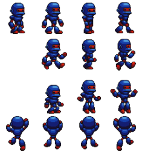
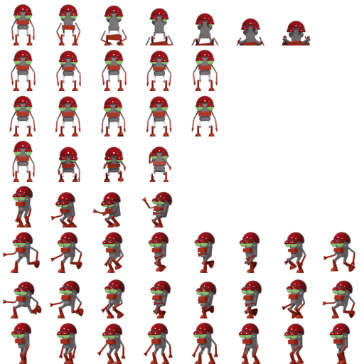
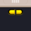
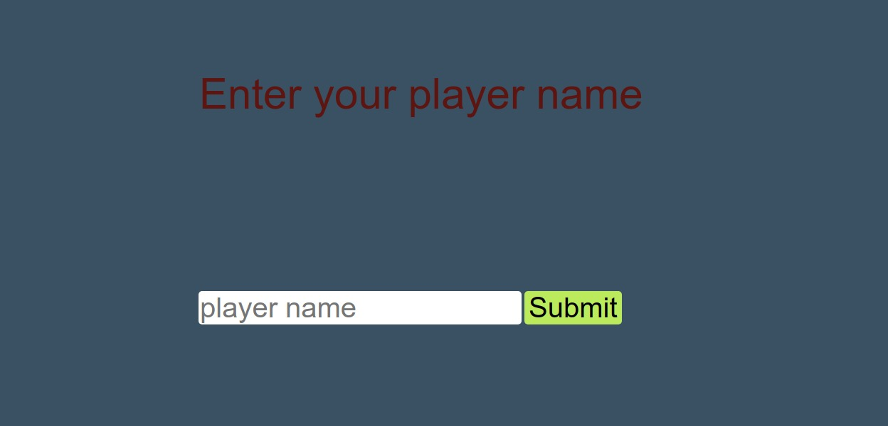
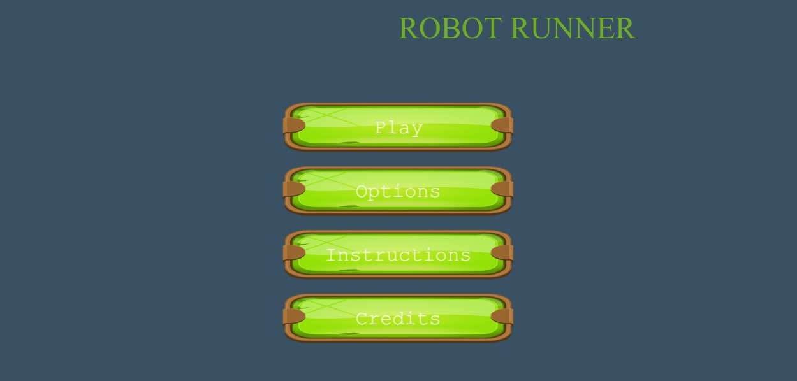
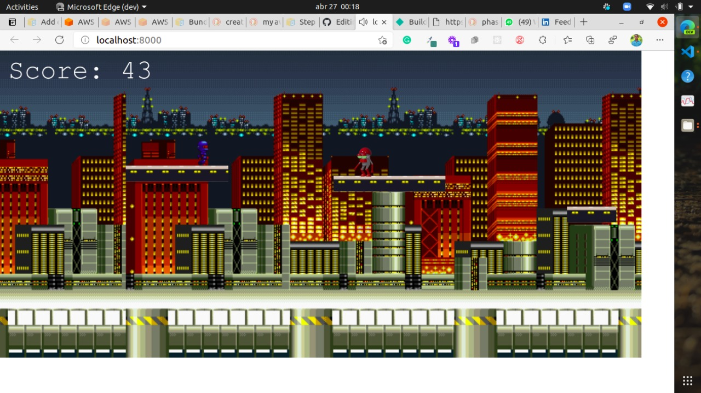
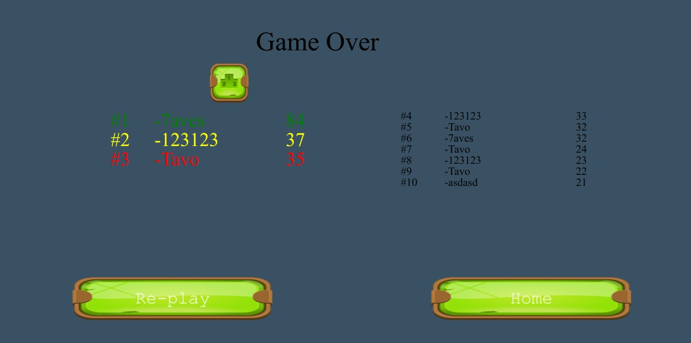
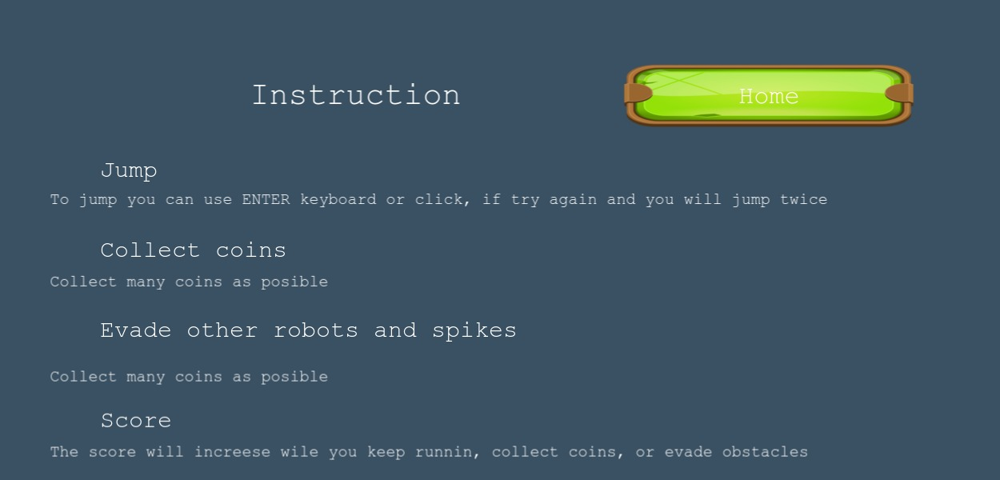
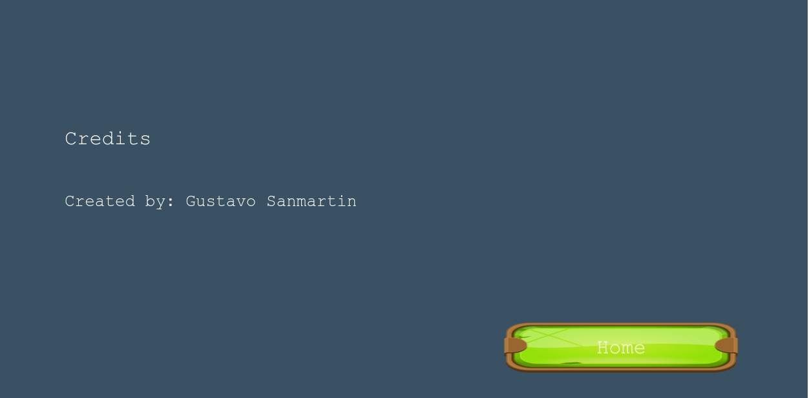

# Robot Runner

This is a platform game develope using Phaser 3 library. the carachter is a robot which has to excapet from the factory it was created, jumping trought platforms with different width and positionated in different heighs, collectio coins, and evading robots and spikes.

The score is incresed, for each plataform  and robot completetly hidded in the right and for each coin collected. Once the score pass some limits the difficulty will be incresed, and spikes are going to apper.

You can submit your player name, and once the player dye, your score will be submited to leaderboard api.

You will see your position if your score is higher than the player in the #10 position.

## Live Version 

[Play me](https://thirsty-mcnulty-d6efb3.netlify.app/)

## How to play

TO play you can use, click or space keyboard.
 With a max 2, your objetive is collec as many coins posible without fall.

 ## Assets

 ### Main Character - Robot Man

### Enemy Character - Robot Enemy

### Platforms

### Spike

### Coins

## Main Scenes

### Enter Name
 This Scene has a text box where the user should enter with a username. The user should press enter and wait for the submission. 

 

### Menu

> Menu Scene - Where you can navigate through the options: Play, Options, Instructions, and Credits

### Game Scene

> Game Scene - Where the game starts. Platforms of different sizes are generated and also random amounts of coins. The user can make the character jump through the platforms using the 'SPACE' key or clicking with the left mouse button. Character is allowed to double jump, but no more than two jumps are allowed. Every time the character collects a coin (overlapping the coin) the Score is increased by 10 units and that should be displayed.

> Submit Scene - When the character finally falls the "Submit Scene" is generated. Where the app will submit his score, 

### Leaderboard

> Leaderboard Scene - After the score submission a leaderboard is displayed and if the last submission is at the top 6, it should be included. This scene contains 2 buttons where the user can choose between play again and come back to the main menu.

### Instructions

> Instructions - The page contains instructions about how to control the character and also the game goal.

### Credits

> Credits - The scene to acknowledge the developer responsible for the game development.

## Built With

- Javascript
- Webpack
- HTML5
- CSS3
- Jest
- Phaser

## Deployed with Netlify

## Prerequisites

- Using NPM package and JavaScript knowledge to build and test the game.
- You should install Node.js to run the server with the dependency used. If you don't have Node you can follow this tutorial to set it on your local machine: [HERE](https://www.w3schools.com/nodejs/default.asp)

## Getting Started

To get a local copy of this project running follow these simple steps.

- Clone this repository
 > `git clone <repo>`
- Navigate to the Repo Folder
- To set Webpack and the dependencies run the command
> `npm install`
- Use your favorite browser to open the index.html file (located at the dist page)

- If you have node.js installed and all the dependencies were installed successfully, you can run the following command to start the server where the project will run.

> `yarn start`

- Open the following path using your favorite browser.

> `http://localhost:8000/`

## Running tests

This project contains Built tests using jest. To run the tests on your local machine you can run the following command on the project folder:
 > `yarn test`

 If you want to build customized tests, you should create new files or edit the files inside the tests/ folder.
 The tests files should be always named with the extension .test.js
 To set the watch mode and keep tracking the tests continuously while you build it you can run
> `yarn test-watch`

## Authors

:bird: **Gustavo Sanmartin** 

- Github: [gasb150](https://github.com/gasb150)
- Twitter: [@7aves](https://twitter.com/7aves)
- Linkedin: [gustavsanmartin](https://www.linkedin.com/in/gustavsanmartin/)

## 🤝 Contributing

Contributions, issues, and feature requests are welcome!

Feel free to check the [issues page](issues/).

## Show your support

Show your support with a star if you like this project!

## Acknowledgments

- Microverse

- opengameart.org

- Gameart2d

## 📝 License

This project is <a href="LICENSE">MIT</a> licensed.
